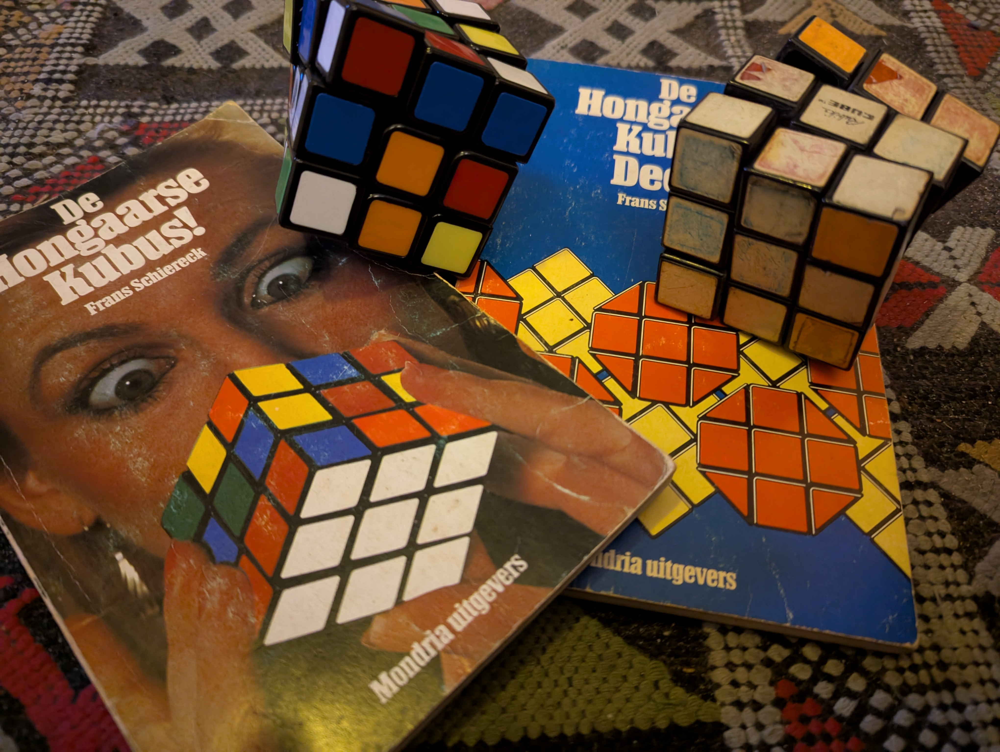
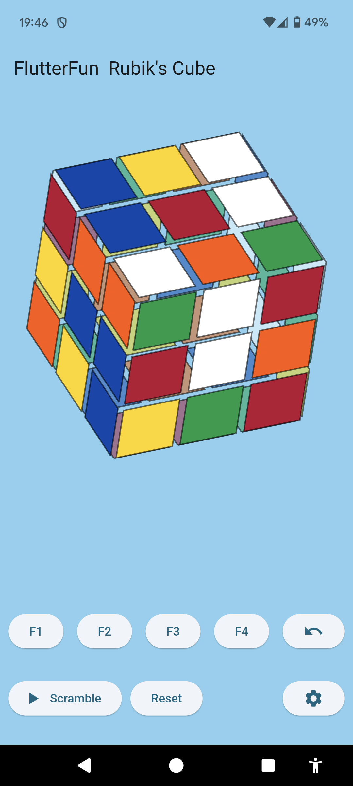

# Rubik's Cube

Ik wilde weer eens wat programmeren en vond het wel een
uitdaging om een virtuele rubik's cube te maken voor Android.
Met flutter en zo.
 
Ter insperatie mijn oude afgeragde cube en oude boekjes opgezocht en ook
maar een nieuwe aangeschat, gewoon om dat het kan, zie plaatje.

In de GitHub repositry staan alleen de `fun` files uit de `lib/` directory.
De andere files kun je eenvoudig maken met `flutter create` of zoiets.

btw: Op de 
[officiele site van van rubiks cube](https://www.rubiks.com/solution-guides)
staat een oplos methode die her en der afwijkt van de methode uit mijn boekjes
uit de jaren tachtig. Daar moet ik ook nog eens naar kijken.....

Oh ja en nog een plaatje van de applicatie (dat rijmt bijna)

